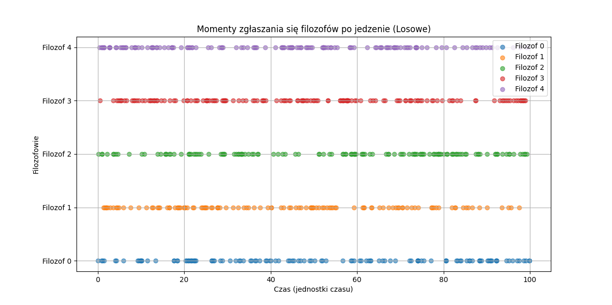

# Dokumentacja projektu: Symulacja problemu 5-ciu filozofów

## 1. Wprowadzenie

### 1.1 Cel projektu

Celem projektu jest stworzenie symulacji problemu 5-ciu filozofów z użyciem koncepcji symulatora sterowanego zdarzeniami. Problem 5-ciu filozofów to klasyczny problem synchronizacji w informatyce, który ilustruje zarządzanie zasobami współdzielonymi. Symulacja ma na celu zbadanie zachowania filozofów w różnych scenariuszach, szczególnie w kontekście możliwości głodowania filozofów.

### 1.2 Opis problemu

Zakłada się, że jest n-filozofów, gdzie n jest liczbą nieparzystą ≥ 3. Każdy filozof podchodzi do swojej miseczki z ryżem (obok miseczki są 2 pałeczki wspólne z sąsiadami) średnio lambda_i razy (lambda_i może być różne dla różnych filozofów) w jednostce czasu. Filozof rozpoczyna jedzenie, jeżeli obie pałeczki wokół jego miski są wolne. Jeżeli nie ma kompletu 2 wolnych pałeczek wokół niego, to jedzenie przepada i możliwy będzie dostęp do miseczki zgodnie z parametrem lambda_i. Zakłada się, że każda z miseczek może obsłużyć w jednostce czasu średnio mi razy (mi - takie same dla wszystkich miseczek) swojego filozofa.

System obserwujemy w trakcie zadanych T jednostek czasu.

## 2. Model symulacji

### 2.1 Założenia

- Liczba filozofów (n) jest nieparzysta i wynosi co najmniej 3.
- Filozofowie zgłaszają się do jedzenia średnio lambda_i razy na jednostkę czasu.
- Czas trwania jedzenia wynosi średnio mi jednostek czasu.
- Symulacja trwa T jednostek czasu.

### 2.2 Struktura symulacji

Symulacja jest realizowana z użyciem techniki sterowania zdarzeniami, co oznacza, że upływ czasu jest kontrolowany przez zdarzenia takie jak zgłoszenia filozofów po jedzenie, zakończenia jedzenia i niespełnione próby.

#### 2.2.1 Klasy

- **Fork**: Reprezentuje pałeczkę używaną przez filozofów. Jest modelem zasobu, który może być używany przez jeden proces w danym czasie.
- **Philosoph**: Reprezentuje filozofa w symulacji. Każdy filozof ma referencje do dwóch pałeczek oraz parametry lambda_i i mi. Proces filozofa obejmuje zgłaszanie się po jedzenie, próby uzyskania obu pałeczek i jedzenie.

**objects.py**
```python
import simpy
import random


class Fork:
    def __init__(self, env, id):
        self.env = env
        self.id = id
        self.resource = simpy.Resource(env, capacity=1)


class Philosoph:
    def __init__(self, env, id, left_chopstick, right_chopstick, lambda_i, mi, deterministic=True):
        self.env = env
        self.id = id
        self.left_chopstick = left_chopstick
        self.right_chopstick = right_chopstick
        self.lambda_i = lambda_i
        self.mi = mi
        self.deterministic = deterministic
        self.unsuccessful_attempts = 0
        self.eating_times = []
        self.request_times = []
        self.action = env.process(self.run())

    def eat(self):
        eating_duration = self.mi if self.deterministic else random.expovariate(1/self.mi)
        self.eating_times.append(eating_duration)
        yield self.env.timeout(eating_duration)

    def run(self):
        while True:
            inter_arrival_time = self.lambda_i if self.deterministic else random.expovariate(1/self.lambda_i)
            yield self.env.timeout(inter_arrival_time)
            self.request_times.append(self.env.now)
            with self.left_chopstick.resource.request() as left_req, self.right_chopstick.resource.request() as right_req:
                result = yield left_req | right_req
                if left_req in result and right_req in result:
                    yield self.env.process(self.eat())
                else:
                    self.unsuccessful_attempts += 1
                    if left_req in result:
                        self.left_chopstick.resource.release(left_req)
                    if right_req in result:
                        self.right_chopstick.resource.release(right_req)
```


#### 2.2.2 Kod symulacji
**main.py**
```python 
from utils import analize, draw_histograms, draw_philosophers_requests, draw_unsuccessful_attempts, run_simulation
from draw_events_array import draw_events


if __name__ == "__main__":
    n = 5
    det_lambda_i = [5, 5, 5, 5, 5]  # Deterministyczne wartości lambda_i
    rand_lambda_i = [0.5, 0.5, 0.5, 0.5, 0.5]  # Losowe wartości lambda_i
    det_mi = 1  # Czas trwania jedzenia
    T = 100  # Czas trwania symulacji

    draw_events(n, T)

    philosophers_det = run_simulation(n, det_lambda_i, det_mi, T, deterministic=True)
    philosophers_rand = run_simulation(n, rand_lambda_i, det_mi, T, deterministic=False)

    draw_philosophers_requests(philosophers_det, 'Momenty zgłaszania się filozofów po jedzenie (Deterministyczne)')
    draw_philosophers_requests(philosophers_rand, 'Momenty zgłaszania się filozofów po jedzenie (Losowe)')

    unsuccessful_attempts_det, eating_times_det, request_times_det = analize(philosophers_det, 'Wartości Deterministyczne')
    unsuccessful_attempts_rand, eating_times_rand, request_times_rand = analize(philosophers_rand, 'Wartości Losowe')

    draw_histograms(eating_times_det, 'Czas trwania jedzenia (Deterministyczne)')
    draw_histograms(eating_times_rand, 'Czas trwania jedzenia (Losowe)')
    draw_unsuccessful_attempts(unsuccessful_attempts_det, unsuccessful_attempts_rand)
```

**utils.py**
```python
import numpy as np
import matplotlib.pyplot as plt
import simpy

from objects import Philosoph, Fork


def run_simulation(n, lambdas, mi, T, deterministic=True):
    env = simpy.Environment()
    
    chopsticks = [Fork(env, i) for i in range(n)]
    philosophers = [Philosoph(env, i, chopsticks[i], chopsticks[(i+1)%n], lambdas[i], mi, deterministic) for i in range(n)]
    
    env.run(until=T)
    
    return philosophers

def analize(philosophers, title):
    unsuccessful_attempts = [philosoph.unsuccessful_attempts for philosoph in philosophers]
    eating_times = [philosoph.eating_times for philosoph in philosophers]
    request_times = [philosoph.request_times for philosoph in philosophers]

    print(f'\n{title}')
    for philosoph in philosophers:
        print(f'philosoph {philosoph.id}:')
        print(f'  Liczba niespełnionych prób: {philosoph.unsuccessful_attempts}')
        print(f'  Czas trwania jedzenia: {philosoph.eating_times}')
        print(f'  Moment zgłoszeń po jedzenie: {philosoph.request_times}')
    
    return unsuccessful_attempts, eating_times, request_times

def draw_philosophers_requests(philosophers, title):
    plt.figure(figsize=(12, 6))
    for philosoph in philosophers:
        request_times = philosoph.request_times
        filozof_id = philosoph.id
        plt.scatter(request_times, [filozof_id] * len(request_times), label=f'Filozof {filozof_id}', alpha=0.6)
    
    plt.xlabel('Czas (jednostki czasu)')
    plt.ylabel('Filozofowie')
    plt.yticks(range(len(philosophers)), [f'Filozof {i}' for i in range(len(philosophers))])
    plt.title(title)
    plt.legend()
    plt.grid(True)
    plt.show()

def draw_histograms(eating_times, title):
    plt.figure(figsize=(10, 4))
    for i, times in enumerate(eating_times):
        plt.hist(times, bins=10, alpha=0.5, label=f'Filozof {i}')
    plt.xlabel('Czas trwania jedzenia')
    plt.ylabel('Częstotliwość')
    plt.title(title)
    plt.legend()
    plt.show()

def draw_unsuccessful_attempts(unsuccessful_attempts_det, unsuccessful_attempts_rand):
    ind = np.arange(len(unsuccessful_attempts_det))
    width = 0.35

    fig, ax = plt.subplots()
    ax.bar(ind - width/2, unsuccessful_attempts_det, width, label='Deterministyczne')
    ax.bar(ind + width/2, unsuccessful_attempts_rand, width, label='Losowe')

    ax.set_xlabel('Filozofowie')
    ax.set_ylabel('Niespełnione próby')
    ax.set_title('Niespełnione próby dla wartości deterministycznych i losowych')
    ax.set_xticks(ind)
    ax.set_xticklabels([f'Filozof {i}' for i in range(len(unsuccessful_attempts_det))])
    ax.legend()

    plt.show()
```

### 2.3 Tablica zdarzeń

Aby narysować tablicę zdarzeń dla problemu pięciu filozofów w symulacji sterowanej zdarzeniami, musimy zrozumieć, jakie zdarzenia będą w niej przechowywane i jak będą się one rozkładać w czasie symulacji. Przy założeniu, że dla każdego filozofa będą zapisywane momenty zgłoszeń do jedzenia, momenty zakończenia jedzenia oraz niespełnione próby, możemy przedstawić tablicę zdarzeń w sposób graficzny.

#### 2.3.1 Struktura Tablicy Zdarzeń

Tablica zdarzeń może mieć strukturę dwuwymiarowej tablicy, gdzie wiersze reprezentują różne typy zdarzeń (np. zgłoszenie do jedzenia, zakończenie jedzenia, niespełniona próba), a kolumny reprezentują czas w jednostkach czasu.

#### 2.3.2 Założenia:
- **Liczba filozofów (n):** 5
- **Czas trwania symulacji (T):** 100 jednostek czasu
- **Zdarzenia na jednostkę czasu:** Zgłoszenie do jedzenia, zakończenie jedzenia, niespełniona próba

Przy takich założeniach, możemy narysować przykładową tablicę zdarzeń.

#### 2.3.3 Kod do rysowania tablicy zdarzeń

Poniżej znajduje się kod w Pythonie używający bibliotek `matplotlib` oraz `numpy` do wizualizacji tablicy zdarzeń:

```python
import matplotlib.pyplot as plt
import numpy as np

def draw_events(n: int, T: int):
    # Parametry symulacji
    event_types = ['Zgłoszenie do jedzenia', 'Zakończenie jedzenia', 'Niespełniona próba']

    # Tworzenie losowych zdarzeń dla przykładu
    np.random.seed(42)
    events = {event_type: {filozof: np.sort(np.random.choice(range(T), size=(T // 10), replace=False)) for filozof in range(n)} for event_type in event_types}

    # Rysowanie tablicy zdarzeń
    fig, ax = plt.subplots(figsize=(15, 8))

    for i, event_type in enumerate(event_types):
        for filozof in range(n):
            times = events[event_type][filozof]
            ax.scatter(times, [f'{event_type} - Filozof {filozof}' for _ in times], label=f'{event_type} - Filozof {filozof}', alpha=0.6)

    ax.set_xlabel('Czas (jednostki czasu)')
    ax.set_ylabel('Zdarzenie')
    ax.set_title('Tablica zdarzeń w symulacji 5-ciu filozofów')
    plt.xticks(range(0, T + 1, 5))
    plt.legend(loc='upper right')
    plt.grid(True)
    plt.show()

if __name__ == '__main__':
    # Tablica zdarzeń dla 5 filozofów, symulacja przebiega w 100 jednostkach czasu 
    draw_events(5,100)
```

#### 2.3.4 Wyjaśnienie implementacji

1. **Parametry symulacji**:
   - `n`: liczba filozofów (5).
   - `T`: czas trwania symulacji (100 jednostek czasu).
   - `event_types`: typy zdarzeń, które będą rejestrowane.

2. **Tworzenie zdarzeń**:
   - `events`: słownik przechowujący momenty zdarzeń dla każdego filozofa i każdego typu zdarzenia. Dla przykładu, zdarzenia są losowo generowane i rozłożone w czasie symulacji.

3. **Rysowanie tablicy zdarzeń**:
   - Używamy biblioteki `matplotlib` do tworzenia wykresu rozproszonego (`scatter plot`), gdzie każda kropka reprezentuje zdarzenie dla danego filozofa w określonym czasie.
   - Każdy typ zdarzenia jest rysowany w oddzielnym wierszu wykresu.

#### 2.3.5 Wykres wynikowy

 Wykres wynikowy przedstawia tablicę zdarzeń, gdzie oś X reprezentuje czas, a oś Y reprezentuje typy zdarzeń i filozofów. Każda kropka na wykresie reprezentuje zdarzenie dla danego filozofa w określonym momencie czasu.

Wykres umożliwia łatwe zrozumienie, kiedy i jakie zdarzenia występują w trakcie symulacji, co jest kluczowe do analizy dynamiki systemu pięciu filozofów.


## 3. Realizacja

### 3.1 Parametry symulacji

- **Liczba filozofów (n)**: 5
- **det_lambda_i**: Określa częstotliwość zgłaszania się filozofów po jedzenie. Testowane wartości deterministyczne: [5, 5, 5, 5, 5], [1, 10, 1, 10, 1], [10, 10, 10, 10, 10]
- **rand_lambda_i**: Określa częstotliwość zgłaszania się filozofów po jedzenie. Wartości losowe
- **det_mi**: Określa czas trwania jedzenia. Testowane wartości deterministyczne: 1
- **T**: Czas trwania symulacji. Testowana wartość: 100 jednostek czasu

## 4. Analiza wyników

### 4.1 Wyniki symulacji

#### 4.1.1 Wariant deterministyczny

- **Momenty zgłaszania się filozofów po jedzenie**:

  Wartości lambda_i = [5, 5, 5, 5, 5] i mi = 1: Filozofowie zgłaszają się do jedzenia równomiernie, co prowadzi do równomiernego dostępu do pałeczek i braku głodowania.
  
  
  

  Wartości lambda_i = [1, 10, 1, 10, 1] i mi = 1: Filozofowie z mniejszym lambda_i częściej próbują jeść, co może prowadzić do głodowania filozofów z większym lambda_i.
  
  
  

  Wartości lambda_i = [10, 10, 10, 10, 10] i mi = 1: Filozofowie zgłaszają się rzadziej, co może prowadzić do sytuacji, w której rzadko zdobywają pałeczki, ale równomierne próby mogą minimalizować głodowanie.

  
  

- **Czasy trwania jedzenia filozofów**

  

#### 4.1.2 Wariant losowy

- **Momenty zgłaszania się filozofów po jedzenie**

Podobne obserwacje jak w wariancie deterministycznym, ale z większą zmiennością czasów zgłaszania się po jedzenie, co może prowadzić do większej liczby konfliktów przy pałeczkach.



- **Czasy trwania jedzenia filozofów**


### 4.2 Głodowanie filozofów

Przy wysokich wartościach lambda_i (rzadkie próby jedzenia) oraz niskich wartościach mi (krótkie trwanie jedzenia) filozofowie mogą mieć trudności z dostępem do pałeczek, co może prowadzić do głodowania. Szczególnie podatne na głodowanie są scenariusze z dużą różnicą w wartościach lambda_i, gdzie filozofowie z małymi lambda_i dominują dostęp do pałeczek.

## 5. Wnioski

1. **Wartości lambda_i bliskie sobie i umiarkowane**: Filozofowie mają większe szanse na sprawiedliwy dostęp do pałeczek, minimalizując głodowanie.
2. **Zróżnicowane wartości lambda_i**: Filozofowie z mniejszym lambda_i mogą zdominować dostęp do pałeczek, prowadząc do głodowania innych.
3. **Bardzo duże lambda_i**: Filozofowie rzadko próbujący jeść mogą mieć trudności z dostępem do pałeczek, co prowadzi do głodowania.

Symulacja dostarczyła wartościowych wniosków dotyczących zarządzania zasobami współdzielonymi.

## 6. Uruchomienie projektu

### 6.1 Wymagania

- Python 3.12 lub nowszy

### 6.2 Instalacja

1. **Utworzenie i aktywacja wirtualnego środowiska**:
   Utwórz wirtualne środowisko, aby zarządzać zależnościami projektu:

   ```bash
   python -m venv venv
   source venv/bin/activate  # Na Windows: venv\Scripts\activate
   ```

2. **Instalacja zależności**:
   Zainstaluj wymagane biblioteki za pomocą pliku `requirements.txt`:

   ```bash
   pip install -r requirements/requirements.txt
   ```
   
    Poniżej znajduje się przykładowa zawartość pliku `requirements.txt`, który zawiera wszystkie wymagane biblioteki do uruchomienia projektu:

    ```
    contourpy==1.2.1
        # via matplotlib
    cycler==0.12.1
        # via matplotlib
    fonttools==4.51.0
        # via matplotlib
    kiwisolver==1.4.5
        # via matplotlib
    matplotlib==3.9.0
        # via -r .\requirements.in
    numpy==1.26.4
        # via
        #   -r .\requirements.in
        #   contourpy
        #   matplotlib
    packaging==24.0
        # via matplotlib
    pillow==10.3.0
        # via matplotlib
    pyparsing==3.1.2
        # via matplotlib
    python-dateutil==2.9.0.post0
        # via matplotlib
    simpy==4.1.1
        # via -r .\requirements.in
    six==1.16.0
        # via python-dateutil
    ```

    Te wersje bibliotek zostały przetestowane i powinny działać poprawnie z kodem symulacji.

### 6.3 Struktura projektu

W repozytorium po instalacji zależności, struktura projektu powinna wyglądać następująco:

```
symulacja-filozofow/
├──requirements
│   requirements.in
│   requirements.txt
│
└──src
    draw_events_array.py
    main.py
    objects.py
    utils.py
```

### 6.4 Uruchomienie symulacji

Aby uruchomić symulację, wykonaj poniższe polecenie:

```bash
python src/main.py
```

### 6.5 Przykładowe wyniki

Po uruchomieniu skryptu, wyniki symulacji (w tym wykresy momentów zgłaszania się filozofów po jedzenie) zostaną wyświetlone w postaci wykresów wygenerowanych za pomocą biblioteki `matplotlib`.
